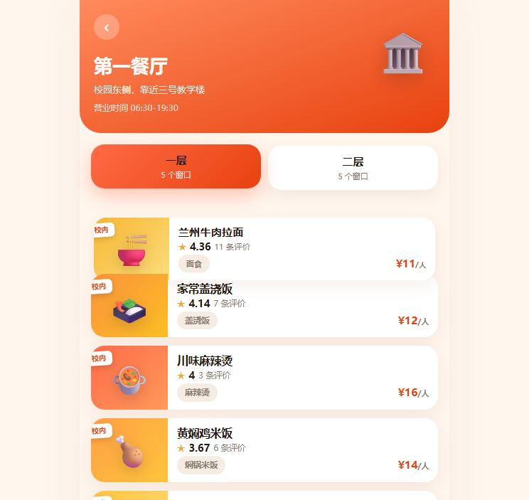
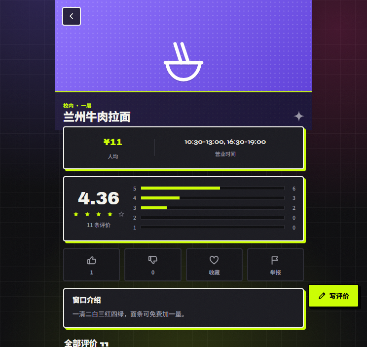

# 食在山财 · SDUFE Food Guide

> 由山东财经大学同学共同维护的校园美食共建平台（移动 H5，当前覆盖**圣井校区**）：食堂窗口档案、星级图文评价、点赞 / 踩、校外店铺自由投稿、外卖信息聚合——人人可查，人人可建。

## 功能特性

- **校内餐厅（圣井校区）**：第一 / 第二 / 第三餐厅，每个餐厅两层，按楼层浏览全部窗口；餐厅与窗口位置按圣井校区实际方位标注
- **窗口档案**：名称、品类、人均价、营业时间、介绍、实拍配图（校内外窗口统一一张表，用类型区分）
- **评价体系**：1–5 星 + 文字 + 最多 6 张实拍图，支持匿名；同一窗口一人一评、可随时修改
- **态度互动**：窗口点赞 / 踩（可改票）、评价点"有用"、收藏窗口、举报内容
- **共建投稿**：同学自由添加窗口、对错误信息发起纠错；投稿经查重、内容安全检测后进入审核队列，通过后公开展示并奖励信用分
- **校外与外卖**：校外店铺地址、电话，美团 / 饿了么跳转入口，记录起送价与配送费
- **榜单工具**：贝叶斯加权好评红榜 / 差评黑榜、"随机吃什么"
- **管理后台**：审核通过 / 驳回、窗口下架、纠错与举报处理、数据概览、操作留痕

## 设计风格

酸性街头（Acid × Neo-Brutalism）：深色近黑底 + 荧光撞色（荧光黄绿 / 热粉 / 电光紫青）、粗黑描边与无模糊硬阴影、错位出血大排版；图标与食物插画全部为统一手绘内联 SVG，不使用 emoji，刻意避开模板化的卡片与渐变。

## 页面截图

| 首页 | 餐厅楼层 | 窗口详情 |
|---|---|---|
|  |  |  |

## 技术栈

| 层 | 技术 |
|---|---|
| 前端 | Vue 3 + Vue Router 4 + Vite 6（手写组件与内联 SVG，无第三方 UI 库） |
| 后端 | Node.js + Express 4 |
| 数据库 | SQLite（better-sqlite3，零安装、文件型，首次启动自动建表并播种） |
| 鉴权 | JWT + bcrypt 密码哈希 |
| 图片上传 | Multer，本地 `uploads/` 目录存储并静态访问 |
| 评分 | 贝叶斯加权平均（防止少量 5 星评价的新窗口霸榜） |

## 目录结构

```
sdufe-food-guide/
├── package.json            # 根工程，concurrently 同时启动前后端
├── server/                 # 后端
│   └── src/
│       ├── index.js        # Express 入口（首次启动自动播种）
│       ├── db.js           # 数据库连接、建表、评分装饰
│       ├── seed.js         # 种子数据（餐厅 / 窗口 / 评价）
│       ├── auth.js         # JWT 中间件
│       └── routes/         # auth / canteens / stalls / reviews / votes / contribute / admin / upload
├── web/                    # 前端
│   └── src/
│       ├── api.js          # fetch 封装、token、图片上传
│       ├── router.js
│       ├── App.vue
│       ├── components/     # FoodCard / FoodArt / StarBar / Icon / Sheet 等
│       └── views/          # 首页 / 餐厅 / 详情 / 搜索 / 投稿 / 登录 / 我的 / 管理后台
├── uploads/                # 用户上传图片（运行时生成）
└── docs/                   # README 截图
```

## 快速开始

环境要求：**Node.js >= 18**（开发环境为 Node 22）。

```bash
# 1. 克隆仓库
git clone https://github.com/<your-name>/sdufe-food-guide.git
cd sdufe-food-guide

# 2. 安装前后端依赖
npm run install:all

# 3. 同时启动后端（:3000）与前端（:5173）
npm run dev
```

浏览器打开 **http://localhost:5173** 即可。后端首次启动且数据库为空时会自动初始化种子数据。

```bash
npm run seed     # 手动重置为初始种子数据（清空并重建全部内容）
```

## 演示账号

| 角色 | 用户名 | 密码 |
|---|---|---|
| 管理员 | `admin` | `admin123` |
| 普通用户 | `xiaoming` | `123456` |

其余普通用户（foodie / ergou / xiaoxue 等）密码均为 `123456`。

## 主要 API

| 方法 | 路径 | 说明 |
|---|---|---|
| POST | `/api/auth/register` · `/api/auth/login` | 注册 / 登录，返回 JWT |
| GET | `/api/canteens` · `/api/canteens/:id` | 餐厅列表（含楼层）/ 餐厅楼层窗口 |
| GET | `/api/stalls` | 窗口列表，支持 keyword / type / category / sort / 分页 |
| GET | `/api/stalls/:id` | 窗口详情、星级分布、当前用户投票与收藏 |
| GET | `/api/stalls/ranking/top` · `ranking/bottom` | 红榜 / 黑榜 |
| GET | `/api/stalls/random/eat` | 随机推荐一个窗口 |
| POST | `/api/stalls/:id/reviews` | 发表 / 修改评价（upsert） |
| POST | `/api/stalls/:id/vote` | 点赞 / 踩 / 取消（vote = 1 / -1 / 0） |
| POST | `/api/stalls/:id/favorite` | 收藏 / 取消收藏 |
| POST | `/api/contribute` | 投稿新窗口（进入待审核） |
| POST | `/api/contribute/stalls/:id/correction` | 信息纠错 |
| POST | `/api/upload` | 上传图片（multipart/form-data） |
| GET/POST | `/api/admin/**` | 管理员审核、下架、举报处理、统计（需 admin 角色） |

## 评分算法

榜单与排序使用贝叶斯加权平均分，评价数越少，分数越向全站均值靠拢：

```
WR = v/(v+m) × R + m/(v+m) × C
```

- `v`：该窗口有效评价数
- `m`：进入榜单所需最小评价数（取 10）
- `R`：该窗口算术平均星级
- `C`：全站窗口平均星级

详情页仍展示直观的算术平均分，赞 / 踩率作为口碑态度单独展示，不与星级混算。

## Roadmap

- [ ] 数据库由 SQLite 迁移至 MySQL + Redis（数据模型已按此设计，可平滑迁移）
- [ ] 部署到香港 / 新加坡轻量云服务器（免 ICP 备案）或 Cloudflare 体系
- [ ] 接入微信 / 邮箱验证码登录
- [ ] 多校区支持（圣井 / 燕山 / 舜耕）
- [ ] 窗口上新订阅与消息提醒

## License

[MIT](LICENSE)
